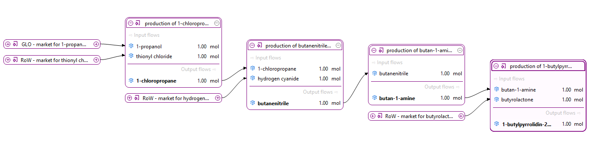
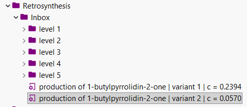
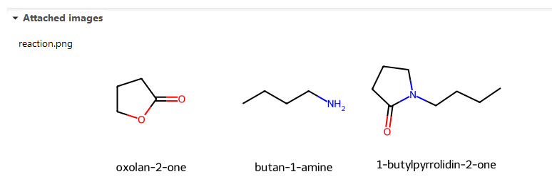

# retrolca

`retrolca` is a toolkit for transforming retrosynthesis pathways into linked
process chains using the openLCA IPC API.

The process generation can be configured in many ways, including the maximum
depth and number of variants of the generated process chains, the retrosynthesis
backend, naming service, caching, and process features like balancing with waste
flows or linking production processes.

The figure below shows an example of a process chain generated by `retrolca`. In
this example, four intermediate processes are created and then automatically
linked to ecoinvent background data.




## Requirements

### The background database

`retrolca` can be used with any openLCA database. If no suitable background
processes are available, it creates all required product flows and processes for
the generated synthesis routes. For this, the openLCA reference flow properties
`Mass` and `Chemical amount` must be present in the database.

Its full potential is realized when used with a background database that already
contains chemical production processes, such as ecoinvent. If the product flows
in that database are annotated with SMILES codes, `retrolca` can automatically
identify and link matching providers while building the process chain. This
avoids regenerating existing background processes and integrates the generated
foreground system directly with the background database.

<details>

<summary>Enabling provider linking with SMILES codes</summary>

For provider linking, `retrolca` needs SMILES codes on the product flows of the
background database. During process generation, these codes are used to identify
matching providers and connect the generated foreground processes with existing
background datasets.

At the moment, `retrolca` reads SMILES information from the additional
properties of a flow and checks the keys `SMILES`, `Absolute-SMILES`, and
`Connectivity-SMILES` (in this order):

[Additional properties](./img/flow_additional_props.png)

In openLCA, you can also try the PubChem tool to get the SMILES code of a
chemical:

[PubChem tool in openLCA](./img/pubchem_tool.png)

`retrolca` also contains tooling to enrich a database with SMILES codes and
other chemical properties from PubChem. If it can find the corresponding data on
PubChem, the `pubchem.py` decorator will also add `Chemical amount` as a flow
property (using the molar mass to calculate the conversion factor from the
reference property `Mass`).

For example, this script would try to decorate all flows with `manufacture of
basic chemicals` in their category path with chemical properties from PubChem:

```python
import olca_ipc as ipc
import retrolca as retro
import retrolca.pubchem as pub

client = ipc.Client()
ctx, _ = retro.IpcContext.of(client)
pub.IpcFlowDecorator(ctx).try_all(in_path="manufacture of basic chemicals")
```

Once a database is decorated, you can persist the collected PubChem decorations
to JSON and later apply them to another database.

```python
pub.dump_decorations(ctx, path)
pub.load_decorations(ctx, path)
```

A full example can be found in the [`pubchem_decorate_flows.py`
example](./examples/pubchem_decorate_flows.py)

Using PubChem is only one possible way to add SMILES codes to chemical products
in openLCA. You can of course use other data sources for this in the same ways.
`retrolca` just needs to find flows with SMILES codes in order to link them in
process chains.


</details>


`ProcessBuilder` is the central component of the workflow. You provide an
`IpcContext`, a retrosynthesis tool, and the limits for the search space,
especially the maximum number of variants (`max_variants`) and the maximum
depth of the generated process chain (`max_levels`). Optionally, you can also
provide a generic production process via `gen_process`.

For every retrosynthesis step, the builder sorts the returned reactions by
their confidence and always builds the variants with the highest score. The
confidence is calculated from retrosynthesis score and feasibility and is also
stored in the generated process name. For each reactant, the builder first
tries to link an existing provider from the background database. If no suitable
provider can be linked, it descends recursively until the configured maximum
depth is reached and creates the missing intermediate processes on the way.

If `gen_process` is set, each generated process also gets an input from this
generic production process. The referenced process must have a single product
output measured in mass. Since each generated process has a product output of
1 mol, `ProcessBuilder` uses the molar mass of that product to calculate the
corresponding mass input from the generic production process.


### Retrosynthesis Tool

`retrolca` can build processes from different retrosynthesis tools. At the
moment, the package supports ASKCOS and AiZynthFinder.

The integration point is intentionally simple: `ProcessBuilder` accepts any
retrosynthesis backend that implements the `RetroTool` protocol. This makes it
easy to plug in other tools without changing the builder itself.

```python
class RetroTool(Protocol):
    id: str
    def expand(self, smiles: str) -> Res[list[Reaction]]: ...
```

Any class that provides an `id` and an `expand(smiles)` method with this shape
can be passed to `ProcessBuilder`. Registering a custom retrosynthesis tool
just means implementing this protocol and then passing the instance as the
`tool` argument.

#### AiZynthFinder

For AiZynthFinder, install the project dependencies and download the public
model files into a local `models` folder.

```bash
# easy with uv; this will create a virtual environment with the dependencies
# AiZynthFinder comes with a script for downloading public models
uv sync
mkdir models
./.venv/bin/download_public_data models

# or on Windows
.\.venv\Scripts\download_public_data.exe models
```

The example in [examples/zynthfinder_example.py](examples/zynthfinder_example.py)
loads the generated `models/config.yml`, wraps it in `ZynthTool`, and passes
that tool to `ProcessBuilder`.

```python
import olca_ipc as ipc
import retrolca as r

tool = r.ZynthTool(Path("models/config.yml"))
ctx, _ = r.IpcContext.of(ipc.Client())
builder = r.ProcessBuilder(
  ctx,
  tool,
  max_levels=5,
  max_variants=2,
  gen_process="83083965-4104-4c87-88af-bc200b6a520c",
)
builder.build(
  "CCCCN1CCCC1=O",
  "1-butylpyrrolidin-2-one",
  category="Retrosynthesis/Inbox",
)
```

This example should then generate the following processes:



#### ASKCOS

For ASKCOS, create a JSON config file with the API endpoint and login data.

```json
{
  "endpoint": "https://your-askcos-instance",
  "user": "your-user",
  "password": "your-password"
}
```

The example in [examples/askcos_example.py](examples/askcos_example.py) loads
that config, creates an `AskcosClient`, and uses it with `ProcessBuilder`.

```python

import olca_ipc as ipc
import retrolca as r

config = r.AskcosConfig.from_file(Path("auth/remote-askcos.json"))
ctx, _ = r.IpcContext.of(ipc.Client())
with r.AskcosClient(config) as tool:
  builder = r.ProcessBuilder(
    ctx,
    tool,
    max_variants=2,
    max_levels=2,
    gen_process="83083965-4104-4c87-88af-bc200b6a520c",
  )
  builder.build(
    "CCOP(=O)(OCC)OCC",
    name="triethyl phosphate",
    category="Retrosynthesis/Inbox",
  )
```

#### Naming service

`ProcessBuilder` can also be configured with a naming service that resolves
names for SMILES codes. This is useful because retrosynthesis tools often
return structures only, while generated openLCA processes and flows should
have readable names.

By default, `ProcessBuilder` uses `CIR`, but any implementation of the
`NamingService` protocol can be passed via the `naming` argument. This makes
the naming lookup configurable in the same way as the retrosynthesis backend.

```python
import olca_ipc as ipc
import retrolca as r

tool = r.CachingRetroTool(
    "cache.sqlite", r.ZynthTool("models/config.yml"),
)
naming = r.CachingNamingService("cache.sqlite", r.CIR())
ctx, _ = r.IpcContext.of(ipc.Client())
builder = r.ProcessBuilder(
    ctx,
    tool,
    naming=naming,
)
builder.build("CCCCN1CCCC1=O", category="Retrosynthesis/Inbox")
```

Custom naming services only need to provide an `id` and a `get_info(smiles)`
method compatible with `NamingService`. If no name can be resolved,
the `ProcessBuilder` falls back to the SMILES code.

## Components

The project uses the following external components:

- [AiZynthFinder](https://github.com/MolecularAI/aizynthfinder): the
  retrosynthesis engine behind the local `aizynthfinder` integration.
- [CIRpy](https://cirpy.readthedocs.io/en/latest/): used to resolve chemical
  names from SMILES codes, because retrosynthesis tools often return only
  structures and no compound names.
- [olca-ipc.py](https://github.com/GreenDelta/olca-ipc.py): the Python client
  used for communication with the openLCA IPC server.
- [RDKit](https://www.rdkit.org/): used for molar-mass calculations,
  generating reaction images, normalizing SMILES strings, and related cheminformatics tasks.
- [Requests](https://requests.readthedocs.io/en/latest/): used for HTTP
  communication with the ASKCOS API and other web services such as PubChem.


For each generated process, `retrolca` also creates a reaction image
showing the reactants together with the product, making it easy to
review the synthesis route later in openLCA.


