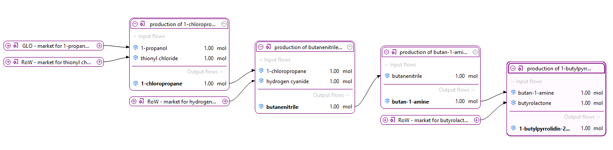
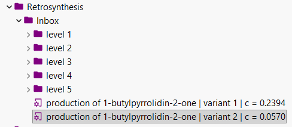
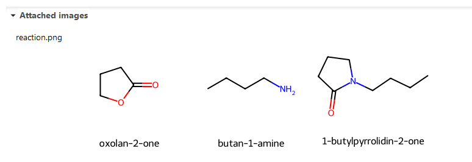

# retrolca

`retrolca` is a toolkit for transforming retrosynthesis pathways into linked
process chains using the openLCA IPC API.

The process generation can be configured in many ways, including the maximum
depth and number of variants of the generated process chains, the retrosynthesis
backend, naming service, caching, and process features like balancing with waste
flows or linking production processes.

The figure below shows an example of a process chain generated by `retrolca`. In
this example, four intermediate processes are created and then automatically
linked to ecoinvent background data.




## Requirements

### The Python Environment and openLCA IPC

`retrolca` is a Python project which can be quickly set up with
[uv](https://docs.astral.sh/uv/). When you downloaded the project, you can then
quickly install the required interpreter and dependencies via `uv sync`:

```bash
# open a terminal and navigate to the project folder
cd retrolca

# download the Python interpreter and dependencies
uv sync

# modify and run the scripts in this project
uv run exampels/...py
```

As said above, `retrolca` communicates with openLCA via the [openLCA IPC
interface](https://greendelta.github.io/openLCA-ApiDoc/). In openLCA, activate
the database where you want to generate the processes and start the IPC server
via `Tools > Developer tools > IPC Server`.


### The Background Database

`retrolca` can be used with any openLCA database, but the flow properties `Mass`
and `Chemical amount` must be present (as provided by the openLCA reference
data). If no suitable background processes are available, `retrolca` creates the
required product flows and processes for the synthesis routes.

However, its full potential is realized with a background database containing
chemical production processes, such as ecoinvent. When the product flows of
these processes have SMILES codes attached, `retrolca` can link them as
production processes for reactants when generating synthesis routes.

<details>

<summary>Adding SMILES codes to product flows in openLCA</summary>

Currently, `retrolca` reads the SMILES codes from the additional properties of
product flows, checking possible entries under `SMILES`, `Absolute-SMILES`, and
`Connectivity-SMILES` (in this order):

[Additional properties](./img/flow_additional_props.png)

In openLCA, you can try the PubChem tool to get the SMILES code of a chemical:

[PubChem tool in openLCA](./img/pubchem_tool.png)

`retrolca` also contains tooling to enrich a database with SMILES codes and
other chemical properties from PubChem. If it can find the corresponding data on
PubChem, the `pubchem` decorator will also add `Chemical amount` as a flow
property (using the molar mass to calculate the conversion factor).

For example, this script would try to decorate all flows with `manufacture of
basic chemicals` in their category path with chemical properties from PubChem:

```python
import olca_ipc as ipc
import retrolca as retro
import retrolca.pubchem as pub

client = ipc.Client()
ctx, _ = retro.IpcContext.of(client)
pub.IpcFlowDecorator(ctx).try_all(in_path="manufacture of basic chemicals")
```

Once a database is decorated, you can persist the collected PubChem decorations
to JSON and later apply them to another database.

```python
pub.dump_decorations(ctx, path)
pub.load_decorations(ctx, path)
```

A full example can be found in the [`pubchem_decorate_flows.py`
example](./examples/pubchem_decorate_flows.py)

Using PubChem is only one possible way to add SMILES codes to chemical products
in openLCA. You can of course use other data sources for this in the same ways.
`retrolca` just needs to find flows with SMILES codes in order to link them in
process chains.

</details>


### The Retrosynthesis Tool

`retrolca` can use different retrosynthesis tools. Currently, it supports ASKCOS
and AiZynthFinder, but another retrosynthesis backend could be easily added. It
just needs to implement the `RetroTool` protocol, providing an `expand` method
to generate possible reactions for a given SMILES code of a chemical:

```python
class RetroTool(Protocol):
    id: str
    def expand(self, smiles: str) -> Res[list[Reaction]]: ...
```

<details>

<summary>Setting up AiZynthFinder</summary>

To setup AiZynthFinder as local retrosynthesis tool, install the project
dependencies via `uv sync` as described above. You will then have a
`download_public_data models` tool in your local Python environment, that can
download the public AiZynthFinder models. Create a `models` folder and set this
as the download target:

```bash
# create the models folder
mkdir models

# download the public AiZynthFinder models
./.venv/bin/download_public_data models

# or on Windows
.\.venv\Scripts\download_public_data.exe models
```

This will download the models and generate a `models/config.yml` file with which
you can initialize the `ZynthTool` then, which wraps the AiZynthFinder in the
`RetroTool` protocol. See the
[examples/zynthfinder_example.py](examples/zynthfinder_example.py) for a full
example.

```python
import retrolca as r

# finds the models/config.yml file relative to the current script file
config = Path(__file__).parent.parent / "models/config.yml"

# initializes AiZynthFinder via the ZynthTool wrapper
tool = r.ZynthTool(config)
```

</details>

<details>

<summary>Connecting to ASKCOS<summary>

`retrolca` can connect to an ASKCOS server instance via it's REST API. For this,
you need to provide the login data of a valid user account as a JSON file with
the following format:

```json
{
  "endpoint": "https://your-askcos-instance/api",
  "user": "your-user",
  "password": "your-password"
}
```

You can also use the public ASKCOS instance and enter
`https://askcos.mit.edu/api` as the API endpoint. You can put that file for
example under `auth/askcos_login.json`, then load it and connect to ASKCOS like
this

```python

import retrolca as r

login = r.AskcosLogin.from_file("auth/askcos_login.json")
client = r.AskcosClient(login)

# close the client when you are done
client.close()
```

See the [examples/zynthfinder_example.py](examples/zynthfinder_example.py) for a
full example. ASKCOS has quite some configuration options which `retrolca` can
pass to the API. If you just want to change the model and keep the default
options, just pass the model name to the client. You can use the constants
`retrolca` defines for this, or just pass the name of the model to the client:

```python
# ...
client = r.AskcosClient(login, model=r.AskcosModel.PISTACHIO)
```

You can also pass in a dictionary with all possible configuration options when
constructing the client:

```python
# ...
client = r.AskcosClient(login, options=
    {
        "retro_backend_options": [
            {
                "retro_backend": "template_relevance",
                "retro_model_name": "reaxys",
                "max_num_templates": 1000,
                "max_cum_prob": 0.995,
                "attribute_filter": [],
                "threshold": 0.3,
                "top_k": 10,
            }
        ],
        "use_fast_filter": True,
        "fast_filter_threshold": 0.75,
        "retro_rerank_backend": "relevance_heuristic",
        "atom_map_backend": "rxnmapper",
        # ...
    },
)
```

See the official ASKCOS API documentation for the full configuration options:

https://askcos.mit.edu/docs#/tree-search/askcos_run_retro_expansion_async

We call the `/api/tree-search/expand-one/call-async` endpoint with the provided
options. The schema for the options of that method is defined under
`#compontnes/schemas/ExpandOneInput` in the API documentation.

</details>

<details>

<summary>Caching retrosynthesis results</summary>

A retrosynthesis tool can be wrapped in a `CachingRetroTool`. This will then
store the returned results of the tool in a database and checks for stored
results before redirecting to the wrapped tool. This can be very useful to avoid
redundant computations. `CachingRetroTool` provides the standard tool protocol
of retrolca and can be used everywhere where this protocol is expected.

```python
caching_tool = r.CachingRetroTool("out/cached_reactions.db", tool)
caching_too.expand("CCOP(=O)(OCC)OCC")
# ...
```

</details>


### The Naming Service

A retrosynthesis tool typically only returns the SMILES codes of the reactants
for a given SMILES code of a product. For creating product flows in openLCA for
these SMILES code, we need a service that translates SMILES codes to names. By
default `retrolca` uses [CIRpy](https://cirpy.readthedocs.io), a Python package
that calls [CIR](https://cactus.nci.nih.gov/chemical/structure), for resolving
chemical names:

```python
import retrolca as r

cir = r.CIR()
name = cir.get_name("CCCCN1CCCC1=O")
```

However, in the same way as for the retrosynthesis tool, there is a common
protocol for the namen service `NamingService` that should be easy to implement for an alternative service. Also, like for the retroysnthesis it is possible and recommended to use the `CachingNamingService` to wrap the naming service to avoid unnecessary requests (APIs like CIR typically have request limits):

```python
import retrolca as r

cir = r.CIR()
caching_cir = r.CachingNamingService("out/cached_names.db", cir)
name = caching_cir.get_name("CCCCN1CCCC1=O")
```


## The Process Builder


By default, `ProcessBuilder` uses `CIR`, but any implementation of the
`NamingService` protocol can be passed via the `naming` argument. This makes
the naming lookup configurable in the same way as the retrosynthesis backend.

```python
import olca_ipc as ipc
import retrolca as r

tool = r.CachingRetroTool(
    "cache.sqlite", r.ZynthTool("models/config.yml"),
)
naming = r.CachingNamingService("cache.sqlite", r.CIR())
ctx, _ = r.IpcContext.of(ipc.Client())
builder = r.ProcessBuilder(
    ctx,
    tool,
    naming=naming,
)
builder.build("CCCCN1CCCC1=O", category="Retrosynthesis/Inbox")
```

`ProcessBuilder` is the central component of the workflow. You provide an
`IpcContext`, a retrosynthesis tool, and the limits for the search space,
especially the maximum number of variants (`max_variants`) and the maximum
depth of the generated process chain (`max_levels`). Optionally, you can also
provide a generic production process via `gen_process`.

For every retrosynthesis step, the builder sorts the returned reactions by
their confidence and always builds the variants with the highest score. The
confidence is calculated from retrosynthesis score and feasibility and is also
stored in the generated process name. For each reactant, the builder first
tries to link an existing provider from the background database. If no suitable
provider can be linked, it descends recursively until the configured maximum
depth is reached and creates the missing intermediate processes on the way.

If `gen_process` is set, each generated process also gets an input from this
generic production process. The referenced process must have a single product
output measured in mass. Since each generated process has a product output of
1 mol, `ProcessBuilder` uses the molar mass of that product to calculate the
corresponding mass input from the generic production process.


```python
import olca_ipc as ipc
import retrolca as r

tool = r.ZynthTool(Path("models/config.yml"))
ctx, _ = r.IpcContext.of(ipc.Client())
builder = r.ProcessBuilder(
  ctx,
  tool,
  max_levels=5,
  max_variants=2,
  gen_process="83083965-4104-4c87-88af-bc200b6a520c",
)
builder.build(
  "CCCCN1CCCC1=O",
  "1-butylpyrrolidin-2-one",
  category="Retrosynthesis/Inbox",
)
```

This example should then generate the following processes:




## Components

The project uses the following external components:

- [AiZynthFinder](https://github.com/MolecularAI/aizynthfinder): the
  retrosynthesis engine behind the local `aizynthfinder` integration.
- [CIRpy](https://cirpy.readthedocs.io/en/latest/): used to resolve chemical
  names from SMILES codes, because retrosynthesis tools often return only
  structures and no compound names.
- [olca-ipc.py](https://github.com/GreenDelta/olca-ipc.py): the Python client
  used for communication with the openLCA IPC server.
- [RDKit](https://www.rdkit.org/): used for molar-mass calculations,
  generating reaction images, normalizing SMILES strings, and related cheminformatics tasks.
- [Requests](https://requests.readthedocs.io/en/latest/): used for HTTP
  communication with the ASKCOS API and other web services such as PubChem.


For each generated process, `retrolca` also creates a reaction image
showing the reactants together with the product, making it easy to
review the synthesis route later in openLCA.


